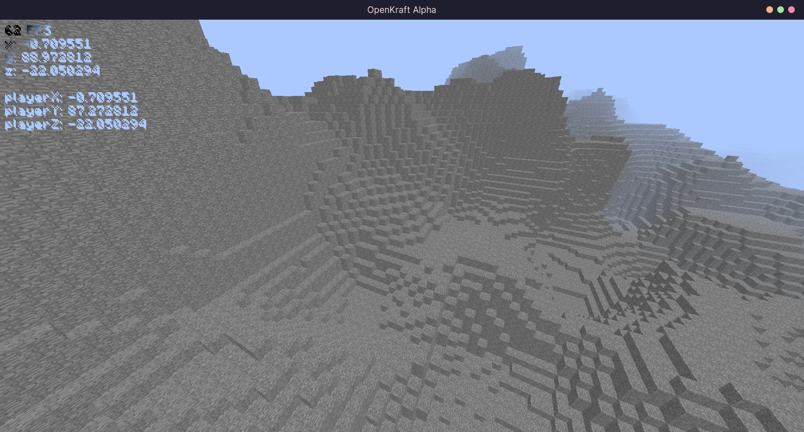
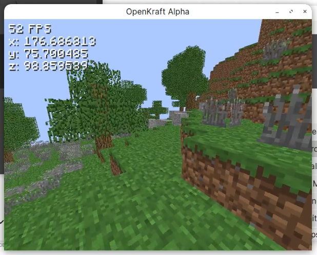

# OpenKraft

# Deprecated

This project has been **abandoned**, because:

- C++ is an unsafe and error prone language.
- I am rewriting it in rust.
- This code is very poorly written, buggy, unstable and slow.

# Description

A basic Minecraft clone in C++ and OpenGL.
This project is fully free and open source under the GPL3.

## Features
### Singleplayer
- 3D Noise based world generation (only stone)
- Movement (walking, looking, jumping)
- Infinite terrain and chunk loading
- 32x32x32 cubic chunks. (Infinite height limit)
### Multiplayer
- Supports joining Minecraft beta 1.7.3 servers
- Chunk loading
- Movement (walking, looking, jumping) (kinda glitchy)
- Live block changes (If someone places/breaks a block, you will see it)

## Disclaimer
This code is very poorly written as I was not experienced in programming when I wrote this. Expect horrible bugs.
Currently some chunk packets aren't supported in multiplayer, so the game will randomly close. Just reopen the game when this happens, for the time being. I won't fix this as it's an abandoned project and a rust rewrite is underway.

## Building and Support
- If you're on linux, use one of these build scripts.
- If you're on windows, I'm sure it will work but you're on your own (this is an abandoned project).
### Build scripts
- `compile.sh` - Release build, maximum optimizations (linux, x86_64)
- `debug-compile.sh` - Debug build, for use with gdb. Memory leak detection included (linux, x86_64)
- `llvm-clang-compile.sh` - Release build, compiled with clang (linux, x86_64)
- `profiler-compile.sh` - Profiler build. Once you close the game, a profile report `profileReport.txt` will be created. Useful for analysing the performance.
Just run these scripts, no arguments needed. The executable will be in `./bin/a.out`
### Required libraries
- SDL
- OpenGL
- GLEW
- GLU
- zlib